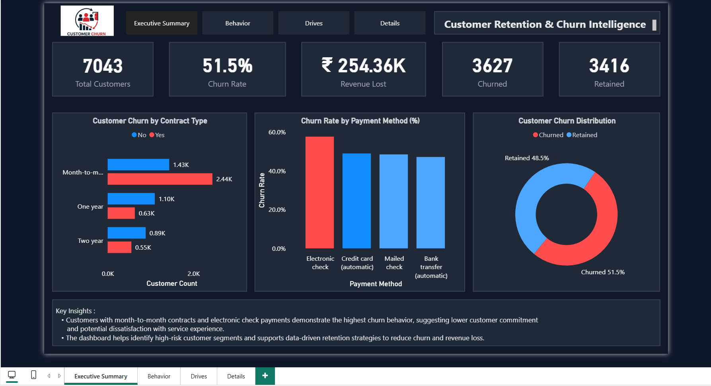
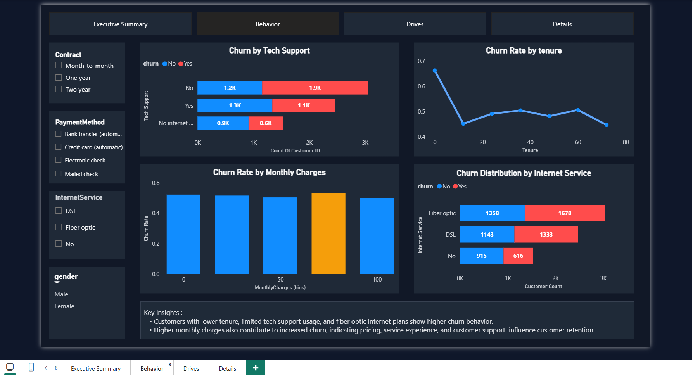
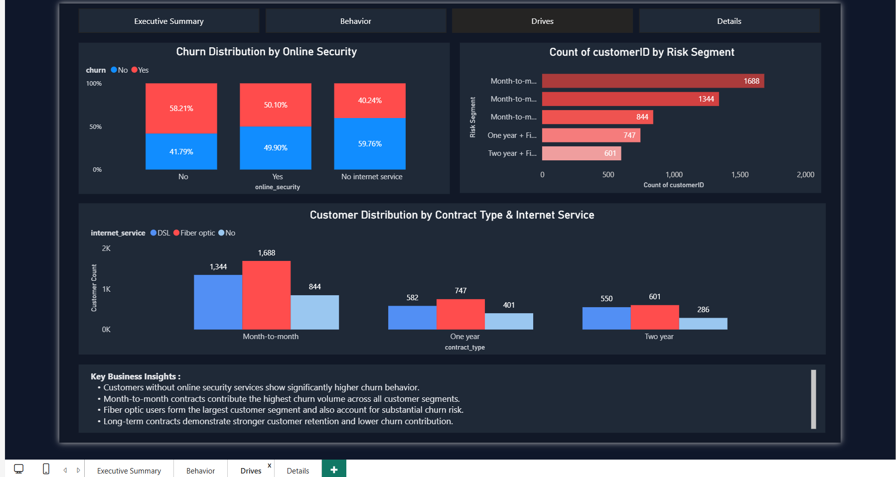
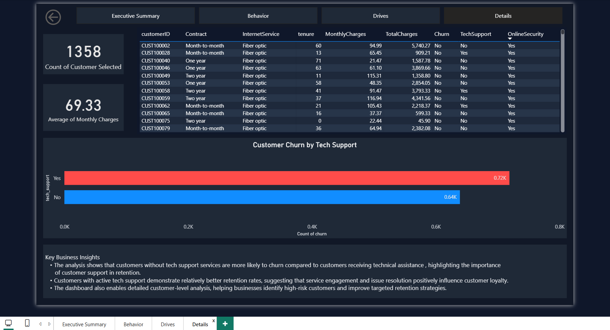
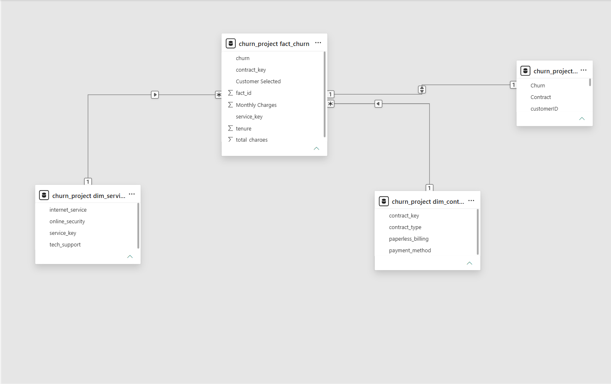

# Customer Retention & Churn Intelligence Dashboard

## Project Overview

This project analyzes customer churn across contract types, internet services, payment methods, and customer support interactions to identify high-risk customer segments and quantify the business impact of customer attrition.

The dashboard combines customer segmentation, churn risk identification, and revenue impact analysis to support data-driven retention strategies.

---

## Business Problem

Customer attrition directly impacts recurring revenue and customer lifetime value. Without proper analysis, businesses struggle to identify high-risk customer segments and implement targeted retention strategies.

This project aims to answer key business questions such as:

- Which customers are most likely to churn?
- How do contract types influence retention?
- Which services and payment methods increase churn risk?
- What is the financial impact of customer churn?

---

## Project Objective

- Identify high-risk customer segments.
- Analyze the major drivers contributing to churn.
- Quantify revenue loss caused by customer attrition.
- Support proactive retention initiatives through data-driven insights.

---

## Key Metrics

- **Total Customers:** 7,043
- **Customers Churned:** 3,627
- **Customers Retained:** 3,416
- **Churn Rate:** 51.5%
- **Revenue Lost:** ₹254.36K

---

### Executive Summary

### Customer Behavior Analysis

### Churn Drivers Analysis

### Customer Details Analysis

### Data Model

---

## Key Insights

- Customers with month-to-month contracts exhibited the highest churn rates.
- Electronic check customers demonstrated significantly higher churn behavior than customers using automatic payment methods.
- Customers without online security and technical support services were more likely to churn.
- Fiber optic customers represented one of the largest high-risk customer segments.
- Customers with lower tenure showed increased churn probability.
- Customer churn resulted in an estimated revenue loss of **₹254.36K**.

---

## Business Recommendations

- Encourage migration from month-to-month contracts to long-term plans.
- Promote automatic payment methods to reduce churn risk.
- Bundle online security and technical support services with internet plans.
- Prioritize retention campaigns for low-tenure and high-risk customers.
- Introduce onboarding initiatives during the first year of customer tenure.

---

## Tools & Technologies Used

- Power BI
- Power Query
- DAX
- Python
- Pandas
- Matplotlib
- Jupyter Notebook
- Data Modeling

---

## Dataset Information

- **Dataset:** IBM Telco Customer Churn Dataset
- **Records:** 7,043 customers
- **Features:** 21 customer attributes
- **Format:** CSV

---

## Project Workflow

1. Performed exploratory data analysis using Python and Jupyter Notebook.
2. Cleaned and transformed data using Power Query.
3. Built a dimensional data model in Power BI.
4. Created DAX measures for KPI calculations and churn analysis.
5. Developed interactive dashboards and generated business insights.

---

## Conclusion

This project demonstrates how customer analytics and business intelligence techniques can be used to identify churn drivers, quantify revenue impact, and support proactive retention strategies.

By combining Python, Power BI, Power Query, and DAX, the dashboard transforms customer subscription data into actionable retention insights that help organizations reduce churn and improve customer retention performance.
